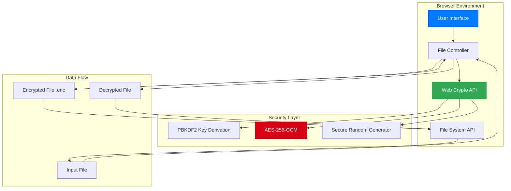
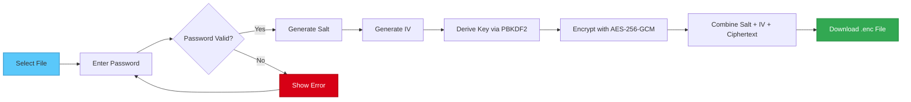
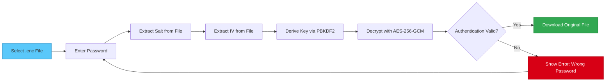
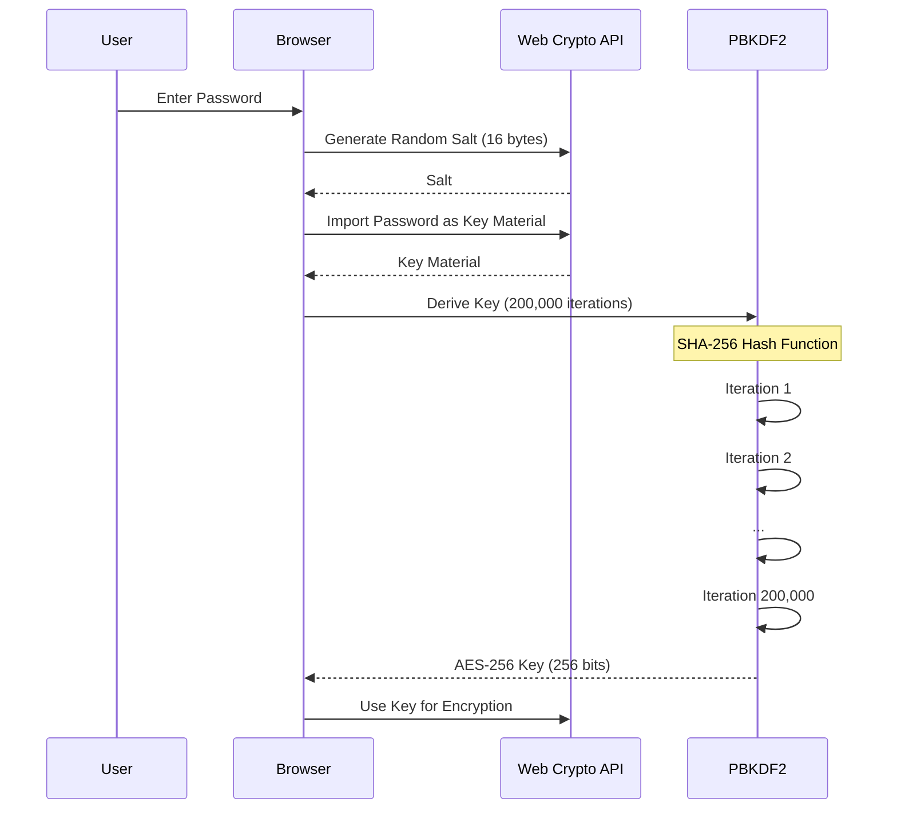
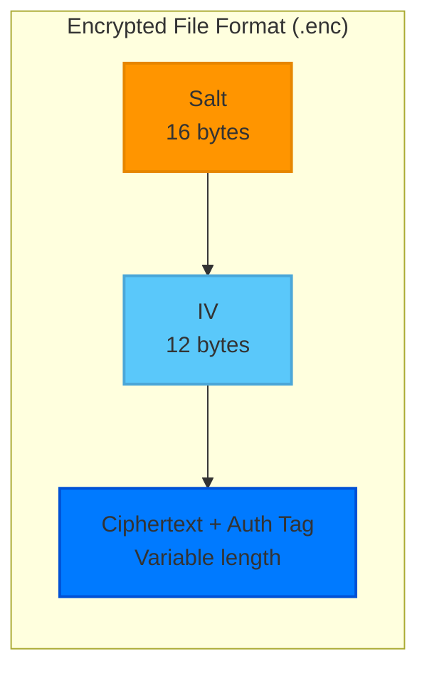
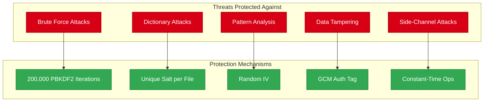
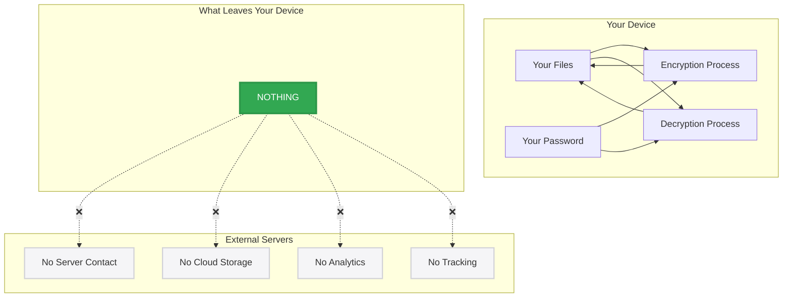

# 🔐 xsukax AES-256 File Encryptor/Decryptor


A **military-grade**, browser-based file encryption tool that provides **unbreakable AES-256-GCM encryption** with complete privacy. All operations happen directly in your browser - your files and passwords never leave your device.

## 🛡️ Why xsukax AES-256 File Encryptor/Decryptor?

### **Absolute Privacy**
- ✅ **100% Client-Side Processing** - No server uploads, ever
- ✅ **Zero-Knowledge Architecture** - Your data never touches our servers
- ✅ **No Registration Required** - Complete anonymity
- ✅ **No Tracking or Analytics** - What you encrypt stays your business
- ✅ **No File Size Limits** - Encrypt files of any size locally
- ✅ **Offline Capable** - Works without internet connection

### **Unbreakable Security**
- 🔒 **AES-256-GCM Encryption** - The gold standard used by governments and military
- 🔑 **PBKDF2 Key Derivation** - 200,000 iterations for maximum password security
- 🎲 **Cryptographically Secure Random** - Unique salt and IV for every encryption
- 🔐 **Web Crypto API** - Native browser cryptography for maximum performance
- 🛡️ **Authenticated Encryption** - GCM mode ensures data integrity and authenticity

## ✨ Features

### **Core Functionality**
- 📁 **Universal File Support** - Encrypt ANY file type (documents, images, videos, archives)
- ⚡ **Lightning Fast** - Hardware-accelerated encryption via Web Crypto API
- 🎨 **Modern Luxurious UI** - Dark theme with elegant animations
- 📊 **Real-time Progress Bar** - Visual feedback with percentage display
- 💾 **Automatic Downloads** - Encrypted files download instantly
- 🔄 **Seamless Decryption** - One-click decryption with password

### **Technical Excellence**
- **No Dependencies** - Pure vanilla JavaScript, no external libraries
- **Cross-Platform** - Works on any modern browser (Chrome, Firefox, Safari, Edge)
- **Mobile Responsive** - Perfect experience on phones and tablets
- **Lightweight** - Single HTML file under 15KB
- **Open Source** - Fully auditable code for transparency

## 🏗️ System Architecture



## 🚀 Getting Started

### **Option 1: Direct Usage**
1. Download the `index.html` file
2. Open it in any modern web browser
3. Start encrypting - no installation needed!

### **Option 2: Host It Yourself**
```bash
# Clone the repository
git clone https://github.com/xsukax/xsukax-AES-256-File-Encryptor-Decryptor-Frontend.git

# Navigate to directory
cd xsukax-AES-256-File-Encryptor-Decryptor-Frontend

# Open in browser
open index.html
# or serve it locally
python -m http.server 8000
```

### **Option 3: GitHub Pages**
Host it free on GitHub Pages for easy access from anywhere!

## 📖 How to Use

### **Encrypting Files**



1. **Select File** - Click "Choose file" and select any file
2. **Enter Password** - Create a strong password (remember it!)
3. **Click Encrypt** - File processes locally with progress indicator
4. **Save .enc File** - Encrypted file downloads automatically

### **Decrypting Files**



1. **Select .enc File** - Choose your encrypted file
2. **Enter Password** - Use the same password from encryption
3. **Click Decrypt** - Original file restored perfectly
4. **Save Original** - Decrypted file downloads with original name

## 🔬 Technical Specifications

### **Encryption Details**
```
Algorithm:        AES-256-GCM
Key Size:         256 bits
Key Derivation:   PBKDF2-SHA256
Iterations:       200,000
Salt Size:        128 bits (16 bytes)
IV Size:          96 bits (12 bytes)
Tag Size:         128 bits (16 bytes)
```

### **Key Derivation Process**



### **Security Architecture**
- **Salt**: Random 16-byte value unique per file prevents rainbow table attacks
- **IV**: Random 12-byte initialization vector ensures identical files encrypt differently
- **PBKDF2**: Transforms passwords into cryptographic keys, resistant to brute force
- **GCM Mode**: Provides both confidentiality and authenticity verification

### **File Structure**



```
Encrypted File Format (.enc):
[Salt (16 bytes)][IV (12 bytes)][Encrypted Data + Auth Tag]
```

## 🛡️ Security Guarantees

### **Security Model**



### **What We Protect**
- ✅ **File Contents** - Encrypted with military-grade AES-256
- ✅ **File Names** - Original names only visible after decryption
- ✅ **Metadata Privacy** - No timestamps or user data stored
- ✅ **Password Security** - Never stored, logged, or transmitted
- ✅ **Memory Safety** - Automatic cleanup after processing

### **Attack Resistance**
- **Brute Force Protection** - 200,000 PBKDF2 iterations slow down attacks
- **Dictionary Attack Prevention** - Unique salt per file
- **Pattern Analysis Immunity** - Random IV ensures no patterns
- **Tampering Detection** - GCM authentication tag verifies integrity
- **Side-Channel Resistance** - Constant-time operations where possible

## 🔍 Privacy Features

### **Zero-Knowledge Architecture**



### **Complete Transparency**
- 100% open source code
- Single HTML file - easy to audit
- No minification - readable source
- No obfuscation - full transparency
- Standard Web Crypto API - trusted implementation

## 💡 Use Cases

### **Personal**
- 🏥 **Medical Records** - Protect sensitive health information
- 💰 **Financial Documents** - Secure tax returns, statements
- 📸 **Private Photos** - Keep personal memories private
- 🔑 **Password Backups** - Encrypt password manager exports
- 📝 **Personal Journals** - Protect private thoughts

### **Professional**
- 💼 **Business Documents** - Secure contracts and proposals
- 🏗️ **Source Code** - Protect proprietary algorithms
- 📊 **Client Data** - GDPR/HIPAA compliant storage
- 🎨 **Creative Work** - Protect designs before release
- 📧 **Sensitive Communications** - Encrypted email attachments

## 🚨 Security Best Practices

### **Password Guidelines**
- Use **minimum 12 characters** (longer is better)
- Mix uppercase, lowercase, numbers, symbols
- Avoid dictionary words or personal info
- Use unique passwords for different files
- Consider using a password manager

### **Operational Security**
- **Never share passwords** over insecure channels
- **Verify file integrity** after decryption
- **Delete original files** after encryption if needed
- **Store .enc files safely** - they're your only copy
- **Test decryption** before deleting originals

## ⚠️ Important Warnings

> **⚠️ Password Loss = Data Loss**  
> There is NO password recovery. If you forget your password, your data is permanently inaccessible. This is a security feature, not a limitation.

> **⚠️ Not a Backup Solution**  
> Encryption is not backup. Always maintain separate backups of important data.

> **⚠️ Browser Compatibility**  
> Requires modern browser with Web Crypto API support (Chrome 37+, Firefox 34+, Safari 11+)

## 🔧 Browser Requirements

| Browser | Minimum Version | Recommended |
|---------|----------------|-------------|
| Chrome | 37+ | Latest |
| Firefox | 34+ | Latest |
| Safari | 11+ | Latest |
| Edge | 79+ | Latest |
| Opera | 24+ | Latest |

## 📊 Performance

- **Encryption Speed**: ~50-100 MB/s (varies by device)
- **Memory Usage**: Minimal (streams large files)
- **File Size Limit**: None (browser memory dependent)
- **Processing**: Utilizes hardware acceleration when available

## 🤝 Contributing

Contributions are welcome! Please feel free to submit a Pull Request. For major changes, please open an issue first to discuss what you would like to change.

### **Areas for Contribution**
- Additional encryption algorithms
- Performance optimizations
- UI/UX improvements
- Localization/translations
- Security audits

## 📜 License

This project is licensed under the **GNU General Public License v3.0** - see the [LICENSE](LICENSE) file for details.

## 🙏 Acknowledgments

- Web Crypto API developers for providing native cryptography
- The cryptography community for AES and PBKDF2 standards
- Open source contributors worldwide

---

**🔐 Your Privacy is Not For Sale**

Built with ❤️ for the privacy-conscious community

[Live Demo](https://xsukax.github.io/xsukax-AES-256-File-Encryptor-Decryptor-Frontend/xsukax-AES-256-File-Encryptor-Decryptor.html) | [Report Bug](https://github.com/xsukax/xsukax-AES-256-File-Encryptor-Decryptor-Frontend/issues)
